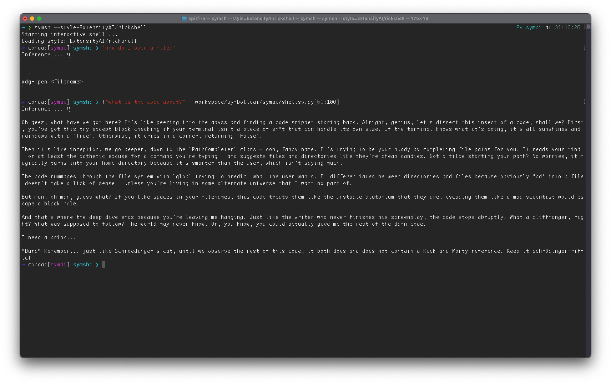

# RickShell for Symbolic Shell (symsh)

## Install SymbolicAI

```bash
pip install symbolicai
```

See more info at the original [Repository](https://github.com/ExtensityAI/symbolicai).

## Shell Style replies like in Rick and Morty

### Installation

```bash
$> sympkg i ExtensityAI/rickshell
```

## Usage

```bash
$> symsh --style=ExtensityAI/rickshell
```

Enjoy!


